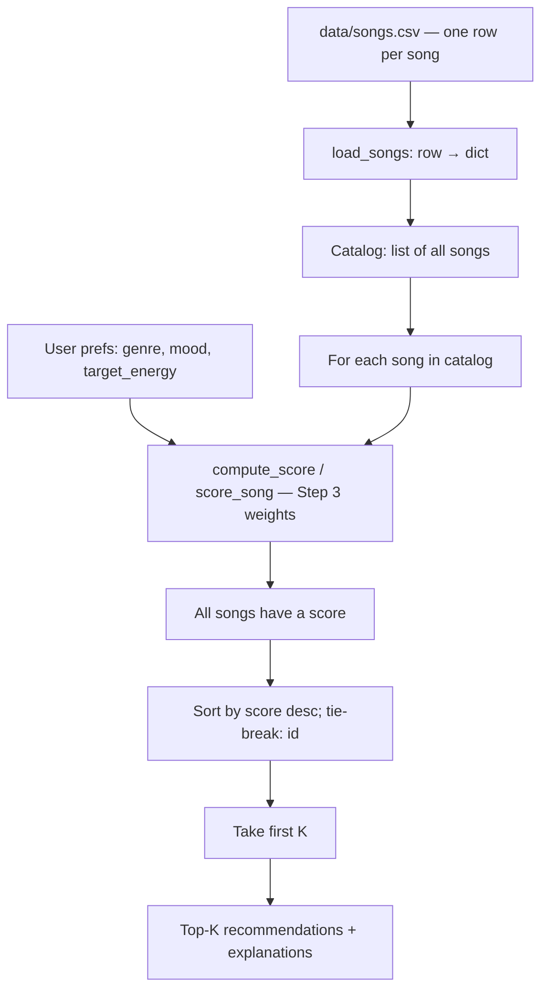

# 🎵 Music Recommender Simulation

## Project Summary

This repo is a **CLI-first** music recommender simulation: songs live in a CSV, user taste is a small preference dict, and **`src/recommender.py`** scores every track from **genre**, **mood**, and **energy**, with **reason strings** for transparency. **`src/main.py`** runs multiple stress-test profiles in the terminal. **Phase 5** write-ups live in **`model_card.md`** (task, data, algorithm in plain language, biases, evaluation, intended / non-intended use, improvements, and **personal reflection**) and **`reflection.md`** for profile comparisons.

---

## How The System Works

Large streaming services combine massive behavioral data (what millions of people play, skip, and save) with content signals (audio analysis, text, and metadata) in multi-stage pipelines: generate candidates, score or rank them with learned models, then often re-rank for diversity and freshness. This project does not use collaborative filtering or live telemetry; it is a **transparent, content-based simulation** on a tiny catalog. It **prioritizes interpretability**: each recommendation comes from explicit rules that match **song attributes** to a **user taste profile**, so you can trace *why* a track was suggested.

**`Song` features (simulation):** `id`, `title`, `artist`, `genre`, `mood`, `energy`, `tempo_bpm`, `valence`, `danceability`, `acousticness` — loaded from `data/songs.csv` for the functional API (`load_songs`) and represented as `Song` objects for the class-based API.

**`UserProfile` fields:** `favorite_genre`, `favorite_mood`, `target_energy` (desired energy on a 0–1 scale), `likes_acoustic` (reserved on the profile for API alignment and future extensions; **current scoring** uses genre, mood, and energy only).

**Scoring and ranking:** For each user–song pair, the scoring rule produces one number; the ranking rule sorts **all** loaded songs by that score (highest first), with ties broken by ascending `id`. The first `k` rows are the **top‑K recommendations**. Short **explanations** summarize genre/mood matches and energy fit.

### Step 3: Recommendation logic

The program uses a **single linear content-based score** per song, then recommends by **sorting** (no collaborative or session data).

#### Algorithm recipe (finalized)

**Inputs**

- From the user: `favorite_genre`, `favorite_mood`, `target_energy` ∈ [0, 1] (and `likes_acoustic` for future use).
- From each song: `genre`, `mood`, `energy` (other CSV columns are available for future extensions).

**Scoring rule (higher = better fit)**

1. **Genre match** — add **2.0** if `song.genre` equals `favorite_genre` after trim + **case-insensitive** comparison, else **0**.
2. **Mood match** — add **1.0** if `song.mood` equals `favorite_mood` (same normalization), else **0**.
3. **Energy fit** — add a value in **[0, 1]** measuring closeness to the target (not “higher energy is always better”):  
   `e = max(0, min(1, 1 - |song.energy - target_energy|))`.

**Combine**

`score = 2.0 * [genre match] + 1.0 * [mood match] + e`  
Maximum score **4.0** when genre and mood match and energy equals the target.

**Ranking rule**

Compute `score` for **every** song in the catalog, sort by `score` descending (tie-break: lower `id` first), return the first `k`.

**Explanations**

For each recommended song, build a short line listing genre/mood matches (if any) and the energy fit, including the numeric similarity and song vs. target energy.

#### Potential biases (expected)

Any fixed rule encodes tradeoffs. This system **weights genre above mood** (2.0 vs 1.0), so it may **over-prioritize genre** and rank a same-genre, weaker mood fit above a **different-genre** track that matches mood and energy very well—e.g. a great “chill” pick in another style may lose to an okay “chill” pick in the user’s favorite genre. **Exact string labels** (no fuzzy synonyms) can miss near-matches like “relaxed” vs “chill.” **Energy** is the only continuous signal; **valence, tempo, danceability, acousticness** are ignored in the score, so two songs with the same genre/mood/energy tie on the rule even when they feel different. **Small catalogs** amplify **representation bias**: genres or moods with few rows rarely win the top slot. **Tie-breaking by `id`** is arbitrary and can quietly favor lower-numbered tracks. Together, these are useful classroom examples of how “transparent” recommenders can still skew outcomes.

### Step 4: Visualize the design

The flowchart below matches the implementation: every CSV row becomes one catalog entry, each song is scored with the same user prefs, then the full catalog is sorted and truncated to top `k`.



### Step 5: Document your plan

The **project plan** and **written design** live in this section so you do not need a separate plan file.

**Goals**

- Load the catalog once from CSV into structured rows.
- Score **each** song with the same rule for a given user.
- Rank globally and return the top `k` with human-readable reasons.

**Pipeline (Input → Process → Output)**

1. **Input** — User preferences (`favorite_genre`, `favorite_mood`, `target_energy`) plus the on-disk catalog `data/songs.csv`.
2. **Process** — `load_songs` parses every row into a dict (or `Song` in the OOP path). For **each** song, `score_song` / `compute_score` applies the Step 3 rule. One row in the file becomes one scored item; no song is skipped.
3. **Output** — Sort all scored songs, take the first `k` → **ranked recommendations** (with score and explanation strings in the functional API).

**How one song moves through the system**

A single CSV row becomes one in-memory song, receives **one** score in the same loop as every other song, participates in the **global** sort, and appears in the final list **if and only if** it lands in the top `k` positions after sorting.

**Implementation map (repo)**

| Piece | Role |
|--------|------|
| `load_songs` | CSV → list of dicts |
| `compute_score` / `score_song` | Shared scoring rule |
| `recommend_songs` | Functional API: rank, top `k`, explanations |
| `Recommender` | OOP API: same scores, returns `Song` list |
| `pytest` | Regression checks on ranking and explanations |

---

## Getting Started

### Setup

1. Create a virtual environment (optional but recommended):

   ```bash
   python -m venv .venv
   source .venv/bin/activate      # Mac or Linux
   .venv\Scripts\activate         # Windows
   ```

2. Install dependencies

```bash
pip install -r requirements.txt
```

3. Run the app:

```bash
python -m src.main
```

### CLI verification (Phase 3 / Step 4)

The simulation is **CLI-first**: `python -m src.main` loads `data/songs.csv` and prints **ranked top 5** for each profile with **title**, **final score**, and **reason** lines from `score_song`.

**Stress-test profiles** (see `src/main.py`): *High-Energy Pop*, *Chill Lofi*, *Deep Intense Rock*. **Edge / adversarial** examples include very high `target_energy` with a **somber** mood, a **melancholic** classical seeker, and a narrow **jazz / relaxed** profile.

**Full terminal log** (all profiles, one run): [`docs/phase4-stress-test-output.txt`](docs/phase4-stress-test-output.txt). For coursework, capture your own terminal screenshots per profile and drop them under `docs/` if images are required.

**Sample visual** (earlier single-profile demo):


**Weight-shift experiment** (Phase 4): half genre weight, double energy points — set env then run:

```bash
MUSIC_RECOMMENDER_EXPERIMENT=weight_shift python -m src.main
```

Capture: [`docs/phase4-weight-shift-output.txt`](docs/phase4-weight-shift-output.txt).

**Why “Gym Hero” can rank high for “happy pop” seekers (plain language):** the program does not know that “intense” is the opposite of “happy.” It only checks whether the **genre** string matches (**pop** → big bonus) and whether **energy** is close to your target. *Gym Hero* is **pop** with very high energy, so it often beats non-pop tracks that actually match **happy** better—unless you change the weights or teach the model what “mood” means beyond the label.

**Checkpoint:** `src/recommender.py` loads CSV rows, scores by explicit rules, and `src/main.py` demonstrates **multiple** taste profiles in the terminal. See **`model_card.md`** (bias / evaluation) and **`reflection.md`** (profile comparisons).

### Running Tests

Run the starter tests with:

```bash
pytest
```

Additional cases belong in `tests/test_recommender.py`.

---

## Advanced challenges (features)

- **Challenge 1 — Richer data:** `data/songs.csv` adds **popularity** (0–100), **release_decade**, **mood_tags** (pipe-separated, e.g. `happy|euphoric`), **production_style** (`bedroom` / `studio` / `live`), **instrumental** (0/1), **vocal_language**. Scoring adds math-based points (popularity scale, decade similarity to optional `preferred_decade`, tag overlap with `favorite_mood`, optional `prefers_bedroom_production`, `wants_instrumental`, `preferred_language`).
- **Challenge 2 — Scoring modes (strategy pattern):** `get_strategy_weights(mode)` returns weights for **`balanced`**, **`genre_first`**, **`mood_first`**, **`energy_focused`**. Switch with `SCORING_MODE=...` when running `python -m src.main`, or set `SHOW_MODE_COMPARE=1` to print all four for the first profile. `ModeStrategy` / `ScoringStrategy` protocol in `src/recommender.py` keeps modes modular.
- **Challenge 3 — Diversity:** `recommend_songs(..., apply_diversity=True)` picks top‑`k` **greedily** with penalties when **artist** or **genre** already appears in the list; reasons may include a **diversity adjustment** line.
- **Challenge 4 — Tables:** CLI output uses **`tabulate`** (`pip install -r requirements.txt`) with columns **# / Title / Artist / Genre / Score / Reasons**.

## Experiments You Tried

- **Multi-profile stress test:** `src/main.py` runs six preference dicts; full log in `docs/phase4-stress-test-output.txt`.
- **Weight shift:** `MUSIC_RECOMMENDER_EXPERIMENT=weight_shift` sets genre to **+1.0** per match and scales energy similarity by **×2** (see `src/recommender.py`); compare `docs/phase4-weight-shift-output.txt` to the baseline log—high-energy rows gain influence, genre-only ties break differently.
- **Feature removal (optional):** comment out the mood branch in `compute_score_and_reasons` locally to see rankings ignore mood; not enabled in the committed default.

---

## Limitations and Risks

- **Tiny catalog** — With ~18 rows, “top 5” often reuses the same genres; results are demos, not population-level behavior.
- **No lyrics or audio** — Only spreadsheet fields; nuance of real tracks is missing.
- **Label rigidity** — Subgenres and synonyms are not merged; mood mismatches are not penalized, only “no mood bonus.”
- **Not for production** — Do not use this system for real user-facing or high-stakes decisions. See [**model_card.md**](model_card.md) for intended vs non-intended use.

---

## Reflection (Phase 5)

The **model card** is the main deliverable: [**model_card.md**](model_card.md). It includes a **Personal Reflection** (learning moments, AI tooling, surprises, next steps). For profile-by-profile notes, see [**reflection.md**](reflection.md).
